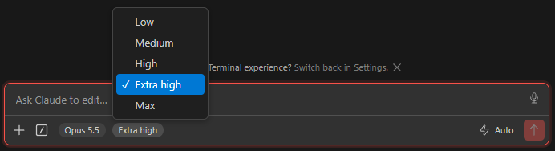

# Effort Picker for Claude Code

> **Unofficial community add-on.** Not affiliated with, endorsed by or supported by Anthropic.
> "Claude" and "Claude Code" are trademarks of Anthropic.

The Claude Code extension for VS Code shows one combined pill in the chat input footer:
**Opus 5.5 Medium** (model plus effort level). This add-on splits it in two:

- the pill shows only the model: **Opus 5.5**
- right next to it, a separate **Medium** button opens a small menu to pick the effort level



Picking a level does exactly what Claude Code's own effort slider does, including remembering it
as that model's default. The menu only lists the levels the current model supports, and models
without effort support (e.g. Haiku) look exactly like before. Mouse and keyboard both work: arrow
keys open and move, Enter picks, Escape closes.

Tested with Claude Code 2.1.284 on VS Code for Windows, light and dark themes, narrow and wide panels.

## Install

1. Download `claude-effort-picker-<version>.vsix` from the [GitHub releases](https://github.com/Trofeomedia/claude-effort-picker/releases).
2. In VS Code: Extensions view, `...` menu, **Install from VSIX...** (or `code --install-extension claude-effort-picker-<version>.vsix`).
3. When it says "Effort Picker applied to Claude Code", click **Reload Window**.

## How it works

Claude Code has no extension API for this, so the add-on appends a small script to the end of
Claude Code's own webview file (`webview/index.js` inside the Claude Code extension folder). It
never edits Claude Code's code, it only adds a clearly marked block at the end, and removing that
block restores the file byte for byte.

- **Claude Code updates:** an update installs a fresh, unpatched copy. The add-on notices, patches
  the new version and asks you to reload the window.
- **Safe failure:** if a future Claude Code version changes its internals, the script leaves the
  stock pill alone and logs a `[claude-effort-picker]` warning in the webview developer tools.
  If the file itself no longer looks as expected, nothing is written and you get a warning.

## Commands

- **Effort Picker: Re-apply to Claude Code**: patch again (also re-enables auto-apply after a remove).
- **Effort Picker: Remove from Claude Code (restore original)**: restores the original file and
  stops auto-applying until you run Re-apply.

Uninstalling the add-on restores Claude Code automatically. VS Code runs that cleanup when it
finalizes the uninstall, which can be after the next restart. Disabling the add-on does **not**
restore anything: run the Remove command first.

## Development

```sh
npm test                          # node --test, no dependencies
npx @vscode/vsce package          # builds the .vsix
```

## License

MIT, see [LICENSE](LICENSE).
